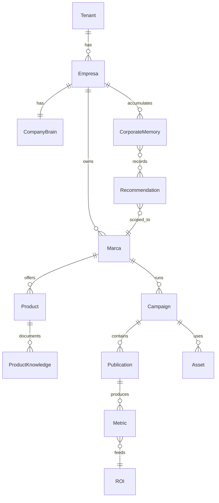

# Marketing OS — Modelo del Dominio

**Versión:** 0.1 (borrador Sprint 1)  
**Estado:** 🔄 En revisión — no implementar código hasta v1.0 aprobado  
**Sprint:** [MARKETING_OS_SPRINT1_DOMAIN_MODEL.md](MARKETING_OS_SPRINT1_DOMAIN_MODEL.md)  
**Visión:** [EMACCION_PRODUCT_VISION_v2.2.md](EMACCION_PRODUCT_VISION_v2.2.md)

> Convención: identificadores en inglés en dominio; etiquetas UI en español.

---

## Reconciliación con código actual

| Dominio (objetivo) | Código hoy | Notas |
|--------------------|------------|-------|
| `Tenant` | `tenant_id` | Aislamiento total |
| `Marca` | `app_id` | No renombrar hasta migración explícita |
| `Empresa` | ≈ tenant en PYME | Opcional como agregado intermedio |
| `Product` | `products.json` / slug | Por tenant o marca |
| `Publication` | `content_queue` posts | Estados editoriales existentes |
| `Campaign` | `campaigns` | Parcial |
| `CompanyBrain` | `business_context.json` | Semilla |
| `ProductKnowledge` | KB articles | `knowledge/*.md` |
| `MarketingPlan` | dominio v1.1 | **Congelado** — subdominio Planificar |
| `Recommendation` | — | No existe |
| `CorporateMemory` | `assistant_audit.jsonl` | Sin modelo |

---

## 1. Catálogo de entidades

Plantilla por entidad: **Responsabilidad · Propietario · Relaciones · Campos · Estado · Eventos**

### 1.1 Organización

#### Tenant

| Atributo | Valor |
|----------|-------|
| **Descripción** | Cliente SaaS de la plataforma EM+Acción |
| **Responsabilidad** | Límite de seguridad, usuarios, datos, billing |
| **Propietario** | Plataforma / super_admin |
| **Relaciones** | 1→N Empresa, Usuario, CorporateMemory |
| **Campos** | `tenant_id`, `display_name`, `status`, `created_at`, `settings` |
| **Estado** | active · suspended · provisioning |
| **Eventos** | `TenantCreated`, `TenantSuspended` |

#### Empresa

| Atributo | Valor |
|----------|-------|
| **Descripción** | Organización operativa dentro del tenant |
| **Responsabilidad** | Agrupa marcas; comparte Corporate Memory |
| **Propietario** | Admin tenant |
| **Relaciones** | N→1 Tenant; 1→N Marca; 1→1 CompanyBrain |
| **Campos** | `company_id`, `tenant_id`, `legal_name`, `country`, `timezone` |
| **Estado** | active · archived |
| **Eventos** | `CompanyProfileUpdated` |

#### Marca (`Brand`)

| Atributo | Valor |
|----------|-------|
| **Descripción** | Línea de negocio / identidad comercial promovible |
| **Responsabilidad** | Scope de campañas, brand, KB producto |
| **Propietario** | Gerente Marketing |
| **Relaciones** | N→1 Empresa; 1→1 BrandGuide; 1→N Product, Campaign |
| **Campos** | `brand_id` (≈ `app_id`), `name`, `slug`, `tone`, `target_audience` |
| **Estado** | active · paused · archived |
| **Eventos** | `BrandCreated`, `BrandPaused` |

#### Usuario · Rol · Equipo

| Entidad | Responsabilidad |
|---------|-----------------|
| **Usuario** | Actor autenticado; pertenece a tenant |
| **Rol** | Conjunto permisos + vista Roadmap (Director, Marketing, Vendedor…) |
| **Equipo** | Agrupación usuarios por función comercial/marketing |

---

### 1.2 Conocimiento

#### CompanyBrain

| Atributo | Valor |
|----------|-------|
| **Descripción** | Perfil institucional de la empresa |
| **Responsabilidad** | Verdad curada: misión, mercado, competencia, objetivos |
| **Propietario** | Admin / Marketing (edición); sistema (lectura) |
| **Relaciones** | 1→1 Empresa |
| **Campos** | `history`, `mission`, `vision`, `values`, `market`, `competitors[]`, `branches[]`, `team[]`, `objectives[]`, `valid_from`, `source`, `last_synced_at` |
| **Estado** | draft · published |
| **Eventos** | `CompanyBrainUpdated`, `ObjectiveChanged` |
| **Ciclo** | Observar · Aprender |

#### CorporateMemory

| Atributo | Valor |
|----------|-------|
| **Descripción** | Memoria viva transversal — todo lo ocurrido y aprendido |
| **Responsabilidad** | Indexar eventos; nunca perder contexto |
| **Propietario** | Sistema (escritura); todos los servicios (lectura) |
| **Relaciones** | N→1 Tenant/Empresa; referencia cualquier entidad |
| **Campos** | `memory_id`, `event_type`, `actor`, `timestamp`, `entity_refs[]`, `payload`, `summary` |
| **Estado** | immutable (append-only) |
| **Eventos** | Todos los eventos de dominio terminan aquí |
| **Ciclo** | Observar · Aprender |

#### ProductKnowledge · KnowledgeArticle · FAQ · Competitor · CaseStudy

| Entidad | Responsabilidad |
|---------|-----------------|
| **ProductKnowledge** | Agregado raíz conocimiento por producto/marca |
| **KnowledgeArticle** | Artículo curado (markdown estructurado) |
| **FAQ** | Pregunta/respuesta oficial |
| **Competitor** | Ficha competidor vinculada a producto |
| **CaseStudy** | Caso de éxito con métricas y CTA |

**Regla:** IA consulta ProductKnowledge antes de Crear contenido.

---

### 1.3 Branding

**Brand** (identidad) · **BrandGuide** (manual) · **Logo** · **ColorPalette** · **Typography** · **Template**

Todas N→1 Marca. Fuente única para generación creativa.

---

### 1.4 Activos

**Asset** (raíz) · **Image** · **Video** · **PDF** · **Flyer** · **Presentation** · **LandingAsset**

Metadatos obligatorios: empresa, marca, producto, idioma, autor, versión, estado, etiquetas, campaña, fecha, canal.

---

### 1.5 Productos

**Product** · **ProductCategory** · **Promotion** · **Offer** · **CTA**

Product N→1 Marca; N↔N Campaign.

---

### 1.6 Marketing

#### Campaign

| Atributo | Valor |
|----------|-------|
| **Descripción** | Iniciativa de marketing con objetivo y canal |
| **Responsabilidad** | Agrupa contenido y mide resultados |
| **Propietario** | Gerente Marketing (crea); sistema (métricas) |
| **Relaciones** | N→1 Marca; N→1 Product (opcional); 1→N Publication, Asset |
| **Campos** | `campaign_id`, `name`, `objective`, `channel`, `budget`, `start_at`, `end_at` |
| **Estado** | Ver § Estados |
| **Eventos** | `CampaignCreated`, `CampaignApproved`, `CampaignPublished`, `CampaignCompleted` |
| **Ciclo** | Planificar · Crear · Ejecutar · Medir |

#### Publication · Content · Channel · EditorialCalendar · CampaignObjective · CampaignStage

Ver glosario. **Publication** = unidad publicable en cola/redes.

---

### 1.7 Comercial

**Lead** · **Opportunity** · **Customer** · **Contact** · **SalesPipeline**

Alimentan Observar y Medir; conversiones → Corporate Memory.

---

### 1.8 Automatización

**Workflow** · **Trigger** · **Action** · **Approval** · **Task** · **Scheduler**

**Approval** obligatoria antes de efectos externos (publicar, enviar, CRM).

---

### 1.9 Analítica

#### Recommendation

| Atributo | Valor |
|----------|-------|
| **Descripción** | Propuesta accionable del Roadmap Engine |
| **Responsabilidad** | Traducir análisis en trabajo asignable |
| **Propietario** | Roadmap Engine (crea); rol asignado (ejecuta) |
| **Relaciones** | N→1 DailyRoadmap; refs Campaign, Lead, Publication… |
| **Campos** | `action`, `assignee_role`, `priority`, `expected_impact`, `status`, `dependencies[]`, `due_at`, `justification_refs[]` |
| **Estado** | pending · in_progress · done · rejected · snoozed |
| **Eventos** | `RecommendationCreated`, `RecommendationAccepted`, `RecommendationRejected` |
| **Ciclo** | Planificar → Ejecutar |

#### KPI · Metric · ROI · Insight · Experiment

ROI responde: *¿qué nos hizo vender más?*

---

## 2. Relaciones (cadena principal)

```
Tenant
  └── Empresa
        ├── CompanyBrain
        ├── CorporateMemory (compartida entre marcas)
        └── Marca (Brand)
              ├── BrandGuide / Assets de marca
              ├── ProductKnowledge
              ├── Product
              ├── Campaign
              │     ├── Publication / Content
              │     └── Asset (Flyer…)
              └── Resultado (Metric → ROI)
                    └── CorporateMemory
```



---

## 3. Ciclo del Marketing OS

| Entidad / grupo | Obs | Anal | Plan | Crear | Ejec | Med | Aprend |
|-----------------|:---:|:----:|:----:|:-----:|:----:|:---:|:------:|
| Lead, Customer, Contact | ✓ | | | | | ✓ | ✓ |
| Opportunity, SalesPipeline | ✓ | ✓ | ✓ | | | ✓ | ✓ |
| Insight, Experiment | | ✓ | ✓ | | | ✓ | ✓ |
| MarketingPlan (v1.1) | | ✓ | ✓ | | | | |
| Recommendation, EditorialCalendar | | ✓ | ✓ | | ✓ | | |
| ProductKnowledge, Brand*, Template | ✓ | | | ✓ | | | ✓ |
| Asset, Flyer, Content, Publication | | | ✓ | ✓ | ✓ | | |
| Campaign | ✓ | ✓ | ✓ | ✓ | ✓ | ✓ | ✓ |
| Workflow, Action, Approval | | | ✓ | | ✓ | | |
| KPI, Metric, ROI | | ✓ | | | | ✓ | ✓ |
| CompanyBrain | ✓ | | | | | | ✓ |
| CorporateMemory | ✓ | | | | | ✓ | ✓ |

---

## 4. Ownership (resumen)

| Entidad | Crea | Modifica | Aprueba | Consume | Aprende |
|---------|------|----------|---------|---------|---------|
| CompanyBrain | Admin | Marketing | Admin | Todos servicios | CorporateMemory |
| ProductKnowledge | Marketing | Marketing | Admin | Crear (IA) | CorporateMemory |
| Campaign | Marketing | Marketing | Director/Mkt | Automation | CorporateMemory, ROI |
| Publication | Marketing/IA | Marketing | Community Mgr | Publisher | CorporateMemory |
| Recommendation | Roadmap Engine | Assignee | Assignee | Console | CorporateMemory |
| Lead | Conector/CRM | Ventas | — | Roadmap | CorporateMemory |

*Matriz completa: completar en v1.0.*

---

## 5. Estados (ciclos de vida)

### Campaign

```
draft → in_review → approved → scheduled → published → completed → archived
```

### Publication

```
draft → pending_approval → approved → scheduled → published → failed → archived
```

### Recommendation

```
pending → in_progress → done | rejected | snoozed
```

### Approval

```
requested → approved | rejected (con actor + timestamp + reason)
```

### Asset

```
draft → approved → in_use → deprecated → archived
```

---

## 6. Auditoría

Todo cambio de estado en agregados core registra:

| Campo | Descripción |
|-------|-------------|
| `actor_id` | Usuario o `system` |
| `timestamp` | UTC |
| `action` | verbo dominio |
| `entity_ref` | tipo + id |
| `result` | success / failure |
| `reason` | opcional, obligatorio en rechazos |
| `origin` | ui · api · automation · connector |

→ Append a **CorporateMemory** como `AuditRecorded`.

---

## 7. Persistencia conceptual

**Fase 1 (actual):** JSON por tenant/marca en filesystem — migrar hacia agregados nombrados.

**Fase 2 (propuesta):** SQLite/Postgres con:

- `tenant_id` en **todas** las tablas
- `brand_id` en entidades de marketing
- CorporateMemory: tabla append-only `memory_events`
- Índices por `entity_type`, `entity_id`, `event_type`, `timestamp`

No optimizar índices en Sprint 1 — solo consistencia referencial.

---

## 8. Reglas de negocio

1. Una **campaña** pertenece a exactamente una **marca**.
2. Un **producto** puede participar en N **campañas**.
3. Todo **contenido** pertenece a una **campaña** y/o **producto**.
4. Toda **publicación** genera **métricas** (aunque sea cero inicial).
5. Toda **métrica** alimenta **Corporate Memory**.
6. Toda **recomendación** tiene **responsable** y **prioridad**.
7. Ninguna **acción externa** (publicar, enviar CRM) sin **Approval** cuando la política lo exige.
8. **MarketingPlan** v1.1 permanece declarativo — no contiene instrucciones de ejecución.
9. **Empresa Viva:** entidades de conocimiento llevan `valid_from`, `source`, `last_synced_at`.
10. **Multi-tenant:** ningún dato cruza `tenant_id`.

---

## 9. Convivencia MarketingPlan v1.1

`MarketingPlan` es agregado **Planificar** — congelado en [MARKETING_PLAN_DOMAIN_v1.1.md](MARKETING_PLAN_DOMAIN_v1.1.md).

- No añadir campos operativos al Plan.
- Roadmap Engine **consume** plan activo; no lo muta directamente.
- Propuestas IA → `Recommendation` o propuestas Plan según capa.

---

## Referencias

- [MARKETING_OS_DOMAIN_EVENTS.md](MARKETING_OS_DOMAIN_EVENTS.md)
- [MARKETING_OS_DOMAIN_SERVICES.md](MARKETING_OS_DOMAIN_SERVICES.md)
- [MARKETING_OS_GLOSSARY.md](MARKETING_OS_GLOSSARY.md)
