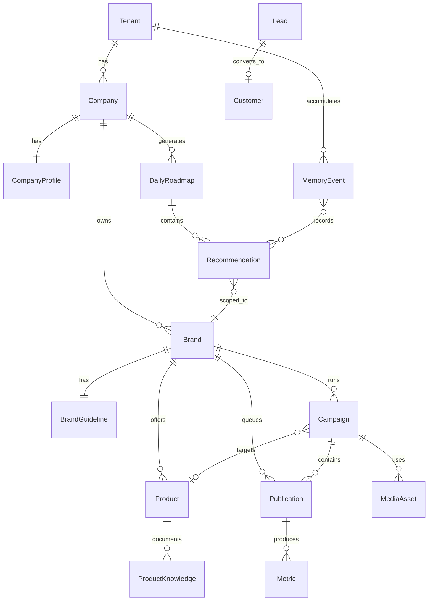

# Marketing OS — Modelo del Dominio

**Versión:** 1.0 · Sprint 1 cerrado  
**Estado:** ✅ Aprobado — NO implementar código hasta capa Arquitectura (Sprint 2)  
**Sprint:** [MARKETING_OS_SPRINT1_DOMAIN_MODEL.md](MARKETING_OS_SPRINT1_DOMAIN_MODEL.md)  
**Constitución:** [MARKETING_OS_CONSTITUTION.md](MARKETING_OS_CONSTITUTION.md)  
**Persistencia:** [MARKETING_OS_DOMAIN_PERSISTENCE.md](MARKETING_OS_DOMAIN_PERSISTENCE.md)

> Convención: identificadores en inglés en dominio; etiquetas UI en español.

---

## Reconciliación con código actual

| Dominio | Código hoy | Tabla objetivo |
|---------|------------|----------------|
| `Tenant` | `tenant_id` | `tenants` |
| `Marca` | `app_id` | `brands.legacy_app_id` |
| `Empresa` | ≈ tenant PYME | `companies` |
| `Product` | `products.json` | `products` |
| `Publication` | `content_queue` | `publications` |
| `Campaign` | `campaigns/` | `campaigns` |
| `CompanyBrain` | `business_context.json` | `company_profiles` |
| `ProductKnowledge` | `knowledge/*.md` | `product_knowledge` + `knowledge_articles` |
| `MarketingPlan` | dominio v1.1 JSON | sin tabla v1.0 |
| `CorporateMemory` | `assistant_audit.jsonl` | `memory_events` |
| `Recommendation` | — | `recommendations` |

---

## 1. Catálogo de entidades

Plantilla: **Responsabilidad · Propietario · Relaciones · Campos · Estado · Eventos · Ciclo**

### 1.1 Organización

#### Tenant

| Atributo | Valor |
|----------|-------|
| **Responsabilidad** | Límite SaaS: seguridad, usuarios, billing, aislamiento |
| **Propietario** | Plataforma / super_admin |
| **Relaciones** | 1→N Company, User, MemoryEvent |
| **Campos** | `tenant_id`, `display_name`, `status`, `settings`, `created_at` |
| **Estado** | active · suspended · provisioning |
| **Eventos** | `TenantCreated`, `TenantSuspended` |

#### Empresa (`Company`)

| Atributo | Valor |
|----------|-------|
| **Responsabilidad** | Organización operativa; agrupa marcas; comparte Memory |
| **Propietario** | Admin tenant |
| **Relaciones** | N→1 Tenant; 1→N Brand; 1→1 CompanyBrain |
| **Campos** | `company_id`, `tenant_id`, `legal_name`, `country`, `timezone` |
| **Estado** | active · archived |
| **Eventos** | `CompanyProfileUpdated` |

#### Marca (`Brand`)

| Atributo | Valor |
|----------|-------|
| **Responsabilidad** | Scope campañas, branding, KB producto |
| **Propietario** | Gerente Marketing |
| **Relaciones** | N→1 Company; 1→1 BrandGuide; 1→N Product, Campaign, Publication |
| **Campos** | `brand_id`, `slug`, `name`, `tone`, `target_audience`, `legacy_app_id` |
| **Estado** | active · paused · archived |
| **Eventos** | `BrandCreated`, `BrandPaused` |

#### Usuario (`User`)

| Atributo | Valor |
|----------|-------|
| **Responsabilidad** | Actor autenticado |
| **Propietario** | Admin tenant |
| **Relaciones** | N→1 Tenant; N↔N Role |
| **Campos** | `user_id`, `email`, `display_name`, `status` |
| **Eventos** | `UserInvited` |

#### Rol (`Role`) · Equipo (`Team`)

| Entidad | Responsabilidad | Eventos |
|---------|-----------------|---------|
| **Role** | Permisos + vista Console por rol | — |
| **Team** | Agrupación usuarios por función | — |

---

### 1.2 Conocimiento

#### CompanyBrain

| Atributo | Valor |
|----------|-------|
| **Responsabilidad** | Verdad curada institucional |
| **Propietario** | Admin/Marketing edita; todos leen |
| **Relaciones** | 1→1 Company |
| **Campos** | `history`, `mission`, `vision`, `values`, `market`, `competitors`, `branches`, `team`, `objectives`, `valid_from`, `source`, `last_synced_at` |
| **Estado** | draft · published |
| **Eventos** | `CompanyBrainUpdated`, `ObjectiveChanged` |
| **Ciclo** | Observar · Aprender |

#### CorporateMemory

| Atributo | Valor |
|----------|-------|
| **Responsabilidad** | Memoria viva append-only de todo lo ocurrido |
| **Propietario** | Sistema escribe; todos leen |
| **Relaciones** | N→1 Tenant; refs cualquier entidad vía `entity_refs` |
| **Campos** | `event_id`, `event_type`, `actor`, `timestamp`, `entity_refs`, `payload`, `summary` |
| **Estado** | immutable |
| **Eventos** | Recibe **todos** los eventos de dominio |
| **Ciclo** | Observar · Medir · Aprender |

#### ProductKnowledge

| Atributo | Valor |
|----------|-------|
| **Responsabilidad** | Agregado raíz KB por producto/marca |
| **Propietario** | Marketing |
| **Relaciones** | N→1 Brand; 1→N KnowledgeArticle, FAQ, CaseStudy |
| **Campos** | `knowledge_id`, `title`, `body_markdown`, `valid_from`, `source`, `last_synced_at` |
| **Estado** | draft · published · archived |
| **Eventos** | `ProductKnowledgeUpdated` |
| **Regla** | IA consulta antes de Crear (Principio 3) |

#### KnowledgeArticle · FAQ · Competitor · CaseStudy

| Entidad | Responsabilidad | Eventos |
|---------|-----------------|---------|
| **KnowledgeArticle** | Artículo curado markdown | `KnowledgeArticlePublished` |
| **FAQ** | P/R oficial producto | — |
| **Competitor** | Ficha competidor | `CompetitorIntelUpdated` |
| **CaseStudy** | Caso éxito + métricas + CTA | `CaseStudyAdded` |

---

### 1.3 Brand Center

#### BrandGuide

| Atributo | Valor |
|----------|-------|
| **Responsabilidad** | Manual de marca unificado |
| **Propietario** | Marketing / Diseño |
| **Relaciones** | 1→1 Brand |
| **Campos** | `manual_md`, `logo_uri`, `colors`, `typography`, `templates` |
| **Eventos** | `BrandingChanged` |

#### Logo · ColorPalette · Typography · Template

Value objects o JSON dentro de `brand_guidelines`. Fuente única para generación creativa.

---

### 1.4 Activos (`Asset` / `MediaAsset`)

| Atributo | Valor |
|----------|-------|
| **Responsabilidad** | Archivo reutilizable con metadatos completos |
| **Propietario** | Marketing / Diseño |
| **Relaciones** | N→1 Brand; opcional Product, Campaign |
| **Campos** | `asset_id`, `asset_type`, `uri`, `language`, `author_id`, `version`, `tags`, `channel` |
| **Estado** | draft · approved · in_use · deprecated · archived |
| **Eventos** | `FlyerGenerated` (tipo flyer) |

Subtipos: **Image**, **Video**, **PDF**, **Flyer**, **Presentation**, **LandingAsset** — discriminador `asset_type`.

---

### 1.5 Productos

#### Product

| Atributo | Valor |
|----------|-------|
| **Responsabilidad** | Oferta comercial promovible |
| **Propietario** | Marketing / Admin |
| **Relaciones** | N→1 Brand; N↔N Campaign; 1→N ProductKnowledge, Offer |
| **Campos** | `product_id`, `slug`, `name`, `description`, `category_id` |
| **Estado** | active · paused · archived |
| **Eventos** | `ProductUpdated` |

#### ProductCategory · Promotion · Offer · CTA

| Entidad | Responsabilidad | Eventos |
|---------|-----------------|---------|
| **ProductCategory** | Taxonomía producto | — |
| **Promotion** | Ventana promocional | `PromotionStarted`, `PromotionEnded` |
| **Offer** | Precio/condición | `PriceChanged` |
| **CTA** | Texto/destino acción | — |

---

### 1.6 Marketing

#### Campaign

| Atributo | Valor |
|----------|-------|
| **Responsabilidad** | Iniciativa con objetivo, canal y métricas |
| **Propietario** | Marketing crea; Director aprueba |
| **Relaciones** | N→1 Brand; N→0..1 Product; 1→N Publication, Asset |
| **Campos** | `campaign_id`, `name`, `objective`, `channel`, `budget`, `start_at`, `end_at` |
| **Estado** | §5 Campaign |
| **Eventos** | `CampaignCreated` … `CampaignCompleted` |
| **Ciclo** | Todas |

#### Publication

| Atributo | Valor |
|----------|-------|
| **Responsabilidad** | Unidad publicable en cola/redes |
| **Propietario** | Marketing / Community Manager |
| **Relaciones** | N→1 Brand; N→0..1 Campaign, Product, Flyer |
| **Campos** | `publication_id`, `channel`, `title`, `body`, `scheduled_at`, `external_post_id` |
| **Estado** | §5 Publication |
| **Eventos** | `PublicationDraftCreated` … `PublicationFailed` |

#### Content · Channel · EditorialCalendar · CampaignObjective · CampaignStage

| Entidad | Responsabilidad |
|---------|-----------------|
| **Content** | Cuerpo creativo antes de publicar |
| **Channel** | LinkedIn, Facebook, email, web… |
| **EditorialCalendar** | Vista temporal acciones por marca |
| **CampaignObjective** | KPI objetivo de campaña |
| **CampaignStage** | Etapa dentro de campaña |

---

### 1.7 Comercial

#### Lead

| Atributo | Valor |
|----------|-------|
| **Responsabilidad** | Contacto potencial detectado |
| **Propietario** | Ventas / Conector |
| **Relaciones** | N→1 Tenant; opcional Brand |
| **Eventos** | `LeadCreated`, `LeadAssigned`, `LeadStaleDetected` |
| **Ciclo** | Observar · Medir |

#### Opportunity · Customer · Contact · SalesPipeline

| Entidad | Responsabilidad | Eventos clave |
|---------|-----------------|---------------|
| **Opportunity** | Oportunidad calificada | `OpportunityIdentified` |
| **Customer** | Cliente convertido | `CustomerConverted`, `CustomerLost` |
| **Contact** | Persona en CRM | `ConversationLogged` |
| **SalesPipeline** | Embudo etapas | — |

---

### 1.8 Automatización

| Entidad | Responsabilidad | Eventos |
|---------|-----------------|---------|
| **Workflow** | Definición secuencia | — |
| **Trigger** | Condición disparo | `WorkflowTriggered` |
| **Action** | Efecto externo | `ActionExecuted`, `ActionFailed` |
| **Approval** | Gate humano | `ApprovalRequested`, `ApprovalGranted`, `ApprovalDenied` |
| **Task** | Tarea asignable | `TaskCreated` |
| **Scheduler** | Programación temporal | — |

---

### 1.9 Analítica y Roadmap

#### DailyRoadmap

| Atributo | Valor |
|----------|-------|
| **Responsabilidad** | Contenedor día/semana de recomendaciones |
| **Propietario** | Roadmap Engine |
| **Relaciones** | N→1 Company; 1→N Recommendation |
| **Campos** | `roadmap_id`, `roadmap_date`, `generated_at` |

#### Recommendation

| Atributo | Valor |
|----------|-------|
| **Responsabilidad** | Propuesta accionable con responsable |
| **Propietario** | Roadmap Engine crea; assignee ejecuta |
| **Relaciones** | N→1 Brand, DailyRoadmap; refs Campaign, Lead… |
| **Campos** | `action`, `assignee_role`, `priority`, `expected_impact`, `status`, `dependencies`, `justification_refs`, `due_at` |
| **Estado** | §5 Recommendation |
| **Eventos** | `RecommendationCreated` … `RecommendationCompleted` |
| **Ciclo** | Planificar → Ejecutar → Aprender |

#### KPI · Metric · ROI · Insight · Experiment

| Entidad | Responsabilidad | Eventos |
|---------|-----------------|---------|
| **Metric** | Medición puntual | `MetricRecorded` |
| **ROI** | Evaluación retorno | `ROIAssessed` |
| **Insight** | Conclusión analítica | `InsightGenerated` |
| **Experiment** | Prueba A/B o hipótesis | `ExperimentStarted`, `ExperimentConcluded` |
| **KPI** | Indicador objetivo | — |

---

## 2. Relaciones y cardinalidad

```
Tenant 1──N Company 1──N Brand 1──N Product 1──N Campaign 1──N Publication
Tenant 1──N MemoryEvent
Company 1──1 CompanyBrain
Company 1──N DailyRoadmap 1──N Recommendation
Brand 1──1 BrandGuide
Brand 1──N ProductKnowledge 1──N KnowledgeArticle
Publication 1──N Metric
Campaign N──0..1 Product
Lead 0..1──1 Customer
```



---

## 3. Ciclo del Marketing OS

| Entidad / grupo | Obs | Anal | Plan | Crear | Ejec | Med | Aprend |
|-----------------|:---:|:----:|:----:|:-----:|:----:|:---:|:------:|
| Lead, Customer, Contact | ✓ | | | | | ✓ | ✓ |
| Opportunity, SalesPipeline | ✓ | ✓ | ✓ | | | ✓ | ✓ |
| Insight, Experiment, ROI | | ✓ | ✓ | | | ✓ | ✓ |
| MarketingPlan (v1.1 JSON) | | ✓ | ✓ | | | | |
| DailyRoadmap, Recommendation, EditorialCalendar | | ✓ | ✓ | | ✓ | | ✓ |
| ProductKnowledge, BrandGuide, Template | ✓ | | | ✓ | | | ✓ |
| MediaAsset, Flyer, Content, Publication | | | ✓ | ✓ | ✓ | | |
| Campaign | ✓ | ✓ | ✓ | ✓ | ✓ | ✓ | ✓ |
| Workflow, Action, Approval, Task | | | ✓ | | ✓ | | |
| KPI, Metric | | ✓ | | | | ✓ | ✓ |
| CompanyBrain | ✓ | | | | | | ✓ |
| CorporateMemory | ✓ | | | | | ✓ | ✓ |

---

## 4. Ownership (matriz completa)

| Entidad | Crea | Modifica | Aprueba | Consume | Aprende |
|---------|------|----------|---------|---------|---------|
| Tenant | super_admin | super_admin | — | Todos | Memory |
| Company | Admin | Admin | Admin | Todos | Memory |
| Brand | Admin | Marketing | Admin | Console, Automation | Memory |
| User | Admin | Admin / self | — | Console | Memory |
| CompanyBrain | Admin | Marketing | Admin | Todos servicios, IA | Memory |
| CorporateMemory | Sistema | — | — | Brain, ROI, Console | — |
| ProductKnowledge | Marketing | Marketing | Admin | Crear (IA), Console | Memory |
| BrandGuide | Diseño | Diseño | Marketing | Crear (IA) | Memory |
| MediaAsset | Marketing/IA | Marketing | Marketing | Campaign, Publisher | Memory |
| Product | Admin | Marketing | Admin | Campaign, KB | Memory |
| Campaign | Marketing | Marketing | Director/Mkt | Automation, ROI | Memory |
| Publication | Marketing/IA | Marketing | Community Mgr | Publisher | Memory |
| Lead | Conector/CRM | Ventas | — | Roadmap, CRM | Memory |
| Opportunity | Ventas/Insight | Ventas | Director | Roadmap | Memory |
| Customer | CRM | Ventas | — | ROI | Memory |
| Recommendation | Roadmap Engine | Assignee | Assignee | Console | Memory |
| DailyRoadmap | Roadmap Engine | — | — | Console | Memory |
| Approval | Automation/UI | Decider | Decider | Automation | Memory |
| Workflow | Admin | Admin | — | Automation | Memory |
| Metric | Conector/Sistema | — | — | ROI, Dashboard | Memory |
| ROI | ROI Engine | — | Director | Roadmap | Memory |
| Insight | Marketing Brain | — | — | Roadmap | Memory |
| Experiment | Marketing | Marketing | Director | — | Memory |
| MarketingPlan | Usuario/API | Usuario | Usuario | Roadmap Engine | Memory |

---

## 5. Estados (ciclos de vida)

### Campaign

`draft → in_review → approved → scheduled → published → completed → archived`

### Publication

`draft → pending_approval → approved → scheduled → published → failed → archived`

### Recommendation

`pending → in_progress → done | rejected | snoozed`

### Approval

`requested → approved | rejected` (actor + timestamp + reason obligatorio en reject)

### MediaAsset

`draft → approved → in_use → deprecated → archived`

### ProductKnowledge / CompanyBrain

`draft → published → archived`

---

## 6. Auditoría

Todo cambio de estado en agregados core → `AuditRecorded` en CorporateMemory:

| Campo | Descripción |
|-------|-------------|
| `actor_id` | Usuario o `system` |
| `timestamp` | UTC ISO-8601 |
| `action` | verbo dominio |
| `entity_ref` | `{type, id}` |
| `result` | success / failure |
| `reason` | obligatorio en rechazos |
| `origin` | ui · api · automation · connector |

---

## 7. Conocimiento vs memoria

| | Conocimiento | Memoria |
|---|--------------|---------|
| **Qué es** | Verdad curada actual | Historial de lo ocurrido |
| **Mutabilidad** | Editable con versionado | Append-only |
| **Agregados** | CompanyBrain, ProductKnowledge, BrandGuide | CorporateMemory (`memory_events`) |
| **Consulta IA** | Principio 3 — buscar primero | Contexto histórico, aprendizaje |
| **Tablas** | `company_profiles`, `product_knowledge`, … | `memory_events` |
| **Borrado** | Archivar (`archived`) | **Prohibido** (Principio 12) |

---

## 8. Flujo: Recomendación (Observar → Aprender)

```
1. OBSERVAR
   LeadCreated / MetricRecorded / CommentReceived
        → memory_events

2. ANALIZAR
   Marketing Brain / ROI Engine leen Memory + CompanyBrain + KB
        → InsightGenerated, ROIAssessed
        → memory_events

3. PLANIFICAR
   Roadmap Engine.generateDailyRoadmap(company, date)
        → DailyRoadmap + RecommendationCreated (assignee, priority, justification_refs)
        → memory_events

4. CREAR (si la recomendación implica contenido)
   Usuario acepta → PublicationDraftCreated / FlyerGenerated
   (Principio 3: consulta KB + BrandGuide antes de IA)

5. EJECUTAR
   ApprovalGranted → PublicationPublished / ActionExecuted
        → memory_events

6. MEDIR
   MetricRecorded vinculado a publication/campaign
        → memory_events

7. APRENDER
   ExperimentConcluded / RecommendationCompleted
   CorporateMemory alimenta próximo ciclo Observar
```

---

## 9. Reglas de negocio

1. Una **campaña** pertenece a exactamente una **marca**.
2. Un **producto** participa en N **campañas**; campaña tiene 0..1 producto foco.
3. Todo **contenido publicable** es **Publication** con marca obligatoria.
4. Toda **publicación** genera **métricas** (aunque cero inicial).
5. Toda **métrica** → Corporate Memory.
6. Toda **recomendación** tiene `assignee_role` y `priority`.
7. Acción externa (publicar, CRM) requiere **Approval** si política tenant lo exige.
8. **MarketingPlan** v1.1 declarativo — sin campos operativos.
9. **Empresa Viva:** conocimiento lleva `valid_from`, `source`, `last_synced_at`.
10. **Multi-tenant:** ningún dato cruza `tenant_id`.
11. **Buscar antes de crear** (Principio 3): orden CompanyBrain → Memory → KB → Brand → Asset.
12. **Memoria no se borra** — solo append y archive flags en agregados editables.

---

## 10. Convivencia MarketingPlan v1.1

Agregado **Planificar** congelado: [MARKETING_PLAN_DOMAIN_v1.1.md](MARKETING_PLAN_DOMAIN_v1.1.md).

- Sin tabla en persistencia v1.0 — JSON `marketing_plans/*.json`.
- Roadmap Engine **lee** plan activo; no muta el Plan.
- Propuestas IA del slice Plan → capa aplicación Plan; recomendaciones operativas → entidad `Recommendation`.

---

## 11. Criterio de aceptación Sprint 1

| # | Pregunta | Respuesta en |
|---|----------|--------------|
| 1 | ¿Entidades del Marketing OS? | §1 Catálogo |
| 2 | ¿Relaciones? | §2 ER |
| 3 | ¿Conocimiento vs memoria? | §7 |
| 4 | ¿Flujo recomendación? | §8 |
| 5 | ¿Tablas por entidad? | [PERSISTENCE](MARKETING_OS_DOMAIN_PERSISTENCE.md) |
| 6 | ¿Multi-tenant? | `tenant_id` everywhere; §9 regla 10 |

---

## Referencias

- [MARKETING_OS_DOMAIN_EVENTS.md](MARKETING_OS_DOMAIN_EVENTS.md)
- [MARKETING_OS_DOMAIN_SERVICES.md](MARKETING_OS_DOMAIN_SERVICES.md)
- [MARKETING_OS_GLOSSARY.md](MARKETING_OS_GLOSSARY.md)
- [adr/0002-marketing-os-persistence-store.md](adr/0002-marketing-os-persistence-store.md)
