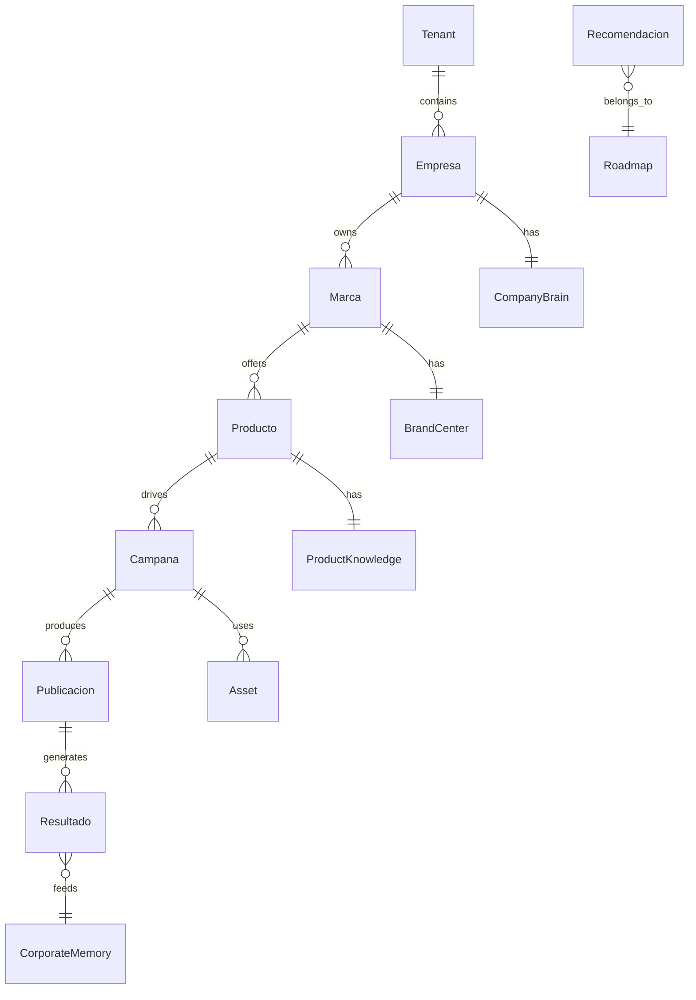

# SPRINT 0 — Arquitectura del Dominio

## EM+Acción Marketing OS v2.2

**Estado:** ✅ Spec cerrada — entregables detallados en **Sprint 1**  
**North star:** [EMACCION_PRODUCT_VISION_v2.2.md](EMACCION_PRODUCT_VISION_v2.2.md)  
**ADR:** [adr/0001-marketing-os-domain-sprint0.md](adr/0001-marketing-os-domain-sprint0.md)  
**No tocar:** [EMACCION_V2_PLAN_MAESTRO.md](EMACCION_V2_PLAN_MAESTRO.md) · código · UI · IA

---

## Objetivo

Convertir la **Product Vision v2.2** en un **modelo de dominio estable** sobre el cual se desarrollarán todos los módulos futuros.

**No desarrollar nuevas funcionalidades para el usuario.**

Este sprint es **exclusivamente de arquitectura**.

> **Por qué Sprint 0 (no Sprint 1):** todavía no construimos el producto; construimos la **arquitectura del producto**. Reduce el riesgo de rehacer modelos, APIs o BD en seis meses por falta de estructura común.

---

## Objetivos del Sprint

Al finalizar debe existir definición clara de:

- Entidades del sistema
- Relaciones entre entidades
- Responsabilidades de cada entidad (**ownership**)
- Modelo de datos inicial (propuesto)
- Servicios de dominio
- Flujo del ciclo del Marketing OS

---

# 1. Modelo del Dominio

Entidades conceptuales mínimas del Marketing OS.

## Organización

| Entidad | Descripción |
|---------|-------------|
| **Tenant** | Límite SaaS: seguridad, usuarios, billing, aislamiento |
| **Empresa** | Organización cliente (puede coincidir con tenant en PYME) |
| **Marca** | Línea de negocio / identidad comercial (≈ `app_id` hoy) |
| **Usuario** | Actor humano del sistema |
| **Rol** | Permisos y vista (Director, Marketing, Vendedor…) |

## Conocimiento

| Entidad | Pilar visión |
|---------|--------------|
| **Company Brain** | 1 |
| **Corporate Memory** | 2 |
| **Product Knowledge** | 3 |
| **Brand Center** | 4 |
| **Asset** | 5 |

## Marketing

| Entidad | Notas |
|---------|-------|
| **Producto** | Oferta comercial bajo una marca |
| **Campaña** | Iniciativa con objetivo y canal |
| **Canal** | LinkedIn, email, web, etc. |
| **Publicación** | Contenido programado/publicado |
| **Flyer** | Asset creativo específico |
| **Plantilla** | Template reutilizable |
| **Calendario** | Vista temporal de acciones |
| **Roadmap** | Plan del día/semana generado por el sistema |
| **Recomendación** | Unidad de propuesta del Roadmap Engine |

## Comercial

| Entidad | Fases ciclo |
|---------|-------------|
| **Lead** | Observar · Medir |
| **Cliente** | Observar · Aprender |
| **Oportunidad** | Analizar · Planificar |
| **Embudo** | Analizar · Medir |
| **Conversación** | Observar · Corporate Memory |

## Automatización

| Entidad | Pilar |
|---------|-------|
| **Workflow** | 9 |
| **Automation** | 9 |
| **Trigger** | 9 |
| **Acción** | 9 |
| **Aprobación** | 9 — humano en el loop |

## Analítica

| Entidad | Pilar |
|---------|-------|
| **KPI** | 10 ROI Engine |
| **Resultado** | Medir |
| **ROI** | 10 |
| **Experimento** | Aprender · Corporate Memory |
| **Insight** | 6 Marketing Brain |

---

# 2. Relaciones

Cadena principal — **ninguna entidad aislada**:

```
Tenant
  ↓
Empresa
  ↓
Marca
  ↓
Producto
  ↓
Campañas
  ↓
Contenido (Publicación · Flyer · Asset)
  ↓
Resultados (KPI · ROI · Lead)
  ↓
Corporate Memory
```

**Corporate Memory** indexa eventos de todas las capas; no duplica KB.

**Reconciliación código actual:**

| Hoy | Dominio Sprint 0 |
|-----|------------------|
| `tenant_id` | Tenant |
| `app_id` | Marca |
| `products.json` | Producto |
| `content_queue` | Publicación |
| `MarketingPlan` v1.1 | Planificar (subdominio congelado) |
| `business_context.json` | Semilla Company Brain |



*Diagrama v0 — refinar cardinalidad en entregable ER.*

---

# 3. Ownership

Cada entidad debe documentar:

| Pregunta | Ejemplo (Recomendación) |
|----------|-------------------------|
| **¿Quién la crea?** | Roadmap Engine (sistema) |
| **¿Quién la modifica?** | Usuario asignado / Marketing |
| **¿Quién la consume?** | Marketing Console, Automation |
| **¿Quién aprende de ella?** | Corporate Memory, ROI Engine |

*Entregable: matriz ownership × entidad (completar en sprint).*

---

# 4. Ciclo del Marketing OS

```
OBSERVAR → ANALIZAR → PLANIFICAR → CREAR → EJECUTAR → MEDIR → APRENDER → (OBSERVAR)
```

Cada entidad indica en qué fase(s) participa:

| Grupo entidades | Fases |
|-----------------|-------|
| Lead, Cliente, Conectores, Conversación | Observar |
| Oportunidad, Embudo, Insight, Marketing Brain | Analizar |
| Roadmap, Recomendación, Calendario, MarketingPlan | Planificar |
| Product Knowledge, Brand Center, Asset, Flyer, Plantilla, AI (generación) | Crear |
| Workflow, Automation, Acción, Publicación, Aprobación | Ejecutar |
| KPI, Resultado, ROI | Medir |
| Experimento, Corporate Memory, Company Brain (sync) | Aprender |

---

# 5. Company Brain

Estructura a definir (sin IA, sin implementación):

- Historia · Misión · Visión · Valores
- Mercado · Competidores
- Servicios · Productos
- Sucursales · Equipo · Objetivos

**Regla Empresa Viva:** campos con `valid_from`, `source`, `last_synced_at`.

---

# 6. Corporate Memory

Modelo a diseñar (sin algoritmos):

- Campañas · Resultados · Correos · Conversaciones
- Flyers · Leads · Clientes · Reuniones
- Decisiones · Aprendizajes
- Cambios de estrategia · Aprobaciones · Experimentos
- Clientes ganados/perdidos + razones

**Unidad atómica propuesta:** `MemoryEvent` (tipo, actor, timestamp, refs, payload).

---

# 7. Product Knowledge

Por producto/marca:

- Descripción · Beneficios · Problemas
- FAQ · Objeciones · Casos de éxito
- Landing · Videos · Promociones · Precios · CTA

---

# 8. Brand Center

Por marca:

- Logo · Colores · Fuentes · Plantillas
- Manual · Videos · Fotografía

---

# 9. Asset Manager

Metadatos obligatorios por activo:

Empresa · Marca · Producto · Idioma · Autor · Versión · Estado · Etiquetas · Campaña · Fecha · Canal

---

# 10. Roadmap Engine

**Sin IA en Sprint 0.** Solo definir el contrato de `Recomendación`:

| Campo | Descripción |
|-------|-------------|
| acción | Qué hacer |
| prioridad | alta / media / baja |
| impacto_esperado | Cuantificado cuando sea posible |
| responsable | Rol o usuario |
| estado | pendiente / en curso / hecho / rechazado |
| dependencias | Otras recomendaciones o prerequisitos |
| fase_ciclo | planificar (origen) → ejecutar (destino) |
| refs | Entidades observadas que justifican la recomendación |

---

# 11. Marketing Console

Solo **navegación** (sin lógica):

Dashboard · Roadmap · Campañas · Assets · Knowledge · Analytics · CRM · Automatizaciones · Chat

*(Workspace Shell = embrión; mapear áreas actuales → paneles objetivo.)*

---

# 12. AI Provider

**Sin integrar proveedores.** Solo interfaces:

| Contrato | Campos |
|----------|--------|
| Provider | id, base_url, model |
| Prompt | context_refs, instructions |
| Respuesta | content, usage |
| Costo | tokens, estimate |
| Capacidades | chat, tools, vision… |

*Límite: capa infra servidor; no dominio tenant UI.*

---

# 13. Automation

Solo **contratos** (sin implementar):

- `Trigger` → condición observable
- `Workflow` → secuencia de acciones
- `Acción` → efecto en mundo externo
- `Aprobación` → gate humano obligatorio cuando aplique

---

# Entregables

Al cierre del Sprint deben existir:

| # | Entregable | Archivo / ubicación |
|---|------------|---------------------|
| 1 | Modelo de dominio documentado | Este doc + `MARKETING_OS_DOMAIN_MODEL.md` *(v1 al cierre)* |
| 2 | Diagrama de entidades | §2 + ER refinado |
| 3 | Relaciones y cardinalidad | `MARKETING_OS_DOMAIN_MODEL.md` |
| 4 | Matriz ownership | `MARKETING_OS_DOMAIN_MODEL.md` |
| 5 | Servicios de dominio | `MARKETING_OS_DOMAIN_SERVICES.md` *(v1 al cierre)* |
| 6 | Contratos (Recomendación, AI, Automation) | §10–13 + ADR |
| 7 | Arquitectura base | ADR-0001 |
| 8 | Base de datos propuesta | `MARKETING_OS_DOMAIN_MODEL.md` § persistencia |
| 9 | APIs propuestas | `MARKETING_OS_DOMAIN_API.md` *(v1 al cierre)* |
| 10 | Flujo Marketing OS | §4 + diagrama secuencia |
| 11 | ADR decisiones | [adr/0001-marketing-os-domain-sprint0.md](adr/0001-marketing-os-domain-sprint0.md) |

---

# Restricciones

- ❌ No crear pantallas nuevas
- ❌ No integrar IA
- ❌ No modificar funcionalidades existentes
- ❌ No cambiar flujos actuales
- ❌ No romper compatibilidad
- ❌ No tocar Plan Maestro en este sprint

---

# Criterio de aceptación

Un desarrollador nuevo debe poder responder:

1. ¿Cuáles son las entidades del Marketing OS?
2. ¿Cómo se relacionan?
3. ¿Qué representa cada una?
4. ¿Dónde se almacena el conocimiento?
5. ¿Dónde vive la memoria?
6. ¿Cómo fluye una recomendación desde **Observación** hasta **Aprendizaje**?

**Si no puede responderlas claramente, el Sprint no está concluido.**

---

# Regla principal

Queda **prohibido** desarrollar funcionalidades por intuición.

Toda funcionalidad futura debe pertenecer explícitamente a:

- un **Pilar** (visión v2.2)
- una **Entidad** (este dominio)
- una **fase del ciclo**
- y aportar al objetivo: **ayudar a vender más** mediante conocimiento, automatización e IA

---

# Qué sigue (post Sprint 0)

| Sprint | Enfoque |
|--------|---------|
| **0** | Arquitectura del dominio — ✅ spec |
| **1** | Modelo del dominio — [Sprint 1](MARKETING_OS_SPRINT1_DOMAIN_MODEL.md) |
| **2+** | Implementación por pilares (post-cierre Sprint 1) |

---

## Referencias

| Doc | Rol |
|-----|-----|
| [EMACCION_PRODUCT_VISION_v2.2.md](EMACCION_PRODUCT_VISION_v2.2.md) | Visión congelada |
| [MARKETING_PLAN_DOMAIN_v1.1.md](MARKETING_PLAN_DOMAIN_v1.1.md) | Subdominio Plan — no romper |
| [EMACCION_TENANT_VS_APP.md](EMACCION_TENANT_VS_APP.md) | Modelo actual |
| [ROADMAP.md](ROADMAP.md) | Seguimiento sprint |
