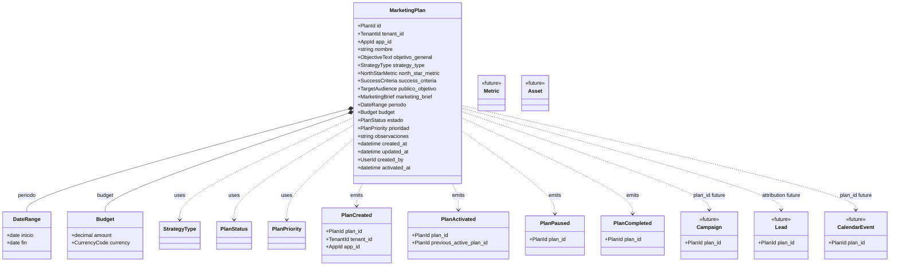

# Pieza 2 — Schema del Dominio de Marketing

**Acción:** 3  
**Versión:** 1.1  
**Estado:** ✅ Aprobado (Pieza 2.5)  
**Fuente de verdad:** [`MARKETING_PLAN_DOMAIN_v1.1.md`](MARKETING_PLAN_DOMAIN_v1.1.md) — **APROBADO · CONGELADO**

> **Regla.** Este schema es una **traducción exacta** del dominio. No agrega reglas de negocio, no elimina reglas, no reinterpreta. Si aparece necesidad de cambiar el dominio, **detener** y revisar el documento fundacional.

**Prohibido en esta pieza:** persistencia, JSON, base de datos, API, UI, servicios, IA, código.

---

## 1. Modelo técnico — Entidad `MarketingPlan`

### 1.1 Identidad y ámbito

| Atributo | Tipo técnico | Obligatorio | Restricciones | Origen dominio |
|----------|--------------|-------------|---------------|----------------|
| `id` | `PlanId` | Sí | UUID v4 o string opaco único global | §4.1 |
| `tenant_id` | `TenantId` | Sí | Debe existir en registry de tenants | §4.1, R4 |
| `app_id` | `AppId` | Sí | Debe existir en registry de apps del tenant | §4.1, R1 |

**Invariante de agregado:** `MarketingPlan` pertenece exactamente a un par `(tenant_id, app_id)`.

### 1.2 Estrategia (declarativa)

| Atributo | Tipo técnico | Obligatorio | Restricciones | Origen dominio |
|----------|--------------|-------------|---------------|----------------|
| `nombre` | `string` | Sí | 3–120 caracteres; trim; no vacío | §4.1 |
| `objetivo_general` | `ObjectiveText` | Sí | 10–2000 caracteres; declarativo (R3) | §4.1, R3 |
| `strategy_type` | `StrategyType` | Sí | Enum §1.3 | §4.2 |
| `north_star_metric` | `NorthStarMetric` | Sí | 3–500 caracteres; una métrica norte | §4.1 |
| `success_criteria` | `SuccessCriteria` | Sí | Ver §2.4 | §4.1 |
| `publico_objetivo` | `TargetAudience` | Sí | Ver §2.5 | §4.1 |
| `marketing_brief` | `MarketingBrief` | Sí | Ver §2.6 | §4.1 |

### 1.3 Periodo y recursos

| Atributo | Tipo técnico | Obligatorio | Restricciones | Origen dominio |
|----------|--------------|-------------|---------------|----------------|
| `periodo` | `DateRange` | Sí | `fecha_fin` ≥ `fecha_inicio` (R6) | §4.1, R6 |
| `periodo.inicio` | `date` (ISO 8601) | Sí | Solo fecha (sin hora) o date-time UTC documentado en implementación | §4.1 |
| `periodo.fin` | `date` (ISO 8601) | Sí | ≥ `periodo.inicio` | §4.1, R6 |
| `budget` | `Budget` | Sí | Ver §2.3 | §4.1 |
| `budget.amount` | `decimal` | Sí | ≥ 0; default 0 | §4.1 |
| `budget.currency` | `CurrencyCode` | Sí | ISO 4217 (3 letras) | §4.1 |

### 1.4 Control y auditoría

| Atributo | Tipo técnico | Obligatorio | Restricciones | Origen dominio |
|----------|--------------|-------------|---------------|----------------|
| `estado` | `PlanStatus` | Sí | Enum §1.4 | §5 |
| `prioridad` | `PlanPriority` | Sí | Enum §1.5 | §4.1 |
| `observaciones` | `string` | No | 0–2000 caracteres | §4.1 |
| `created_at` | `datetime` (UTC) | Sí | Set al crear | §4.1 |
| `updated_at` | `datetime` (UTC) | Sí | Set al mutar | §4.1 |
| `created_by` | `UserId` | Sí | Referencia usuario auth | §4.1, R7 |
| `activated_at` | `datetime` (UTC) | No | Obligatorio si `estado` = `activo`; null en otros | §4.1 |

### 1.5 Enum `StrategyType`

Valores exactos del dominio (§4.2):

```
lead_generation
brand_awareness
remarketing
launch
upselling
cross_selling
retention
```

### 1.6 Enum `PlanStatus`

Valores exactos del dominio (§5):

```
borrador
activo
pausado
finalizado
```

**Máquina de estados (traducción de §5):**

| Desde | Hacia permitido |
|-------|-----------------|
| `borrador` | `activo` |
| `activo` | `pausado`, `finalizado` |
| `pausado` | `activo`, `finalizado` |
| `finalizado` | *(ninguno — terminal)* |

### 1.7 Enum `PlanPriority`

```
alta
media
baja
```

### 1.8 Reglas de agregado (traducción R1–R9)

| ID | Regla en schema | Tipo |
|----|-----------------|------|
| R1 | Unique `(tenant_id, app_id)` where `estado = activo` | Invariante repositorio/servicio |
| R2 | Transición a `activo` requiere resolución si existe otro `activo` | Regla de aplicación |
| R3 | Validación declarativa en `objetivo_general` y `marketing_brief` (heurística + revisión humana) | Validación |
| R4 | No representable en schema; regla de consumidor (Context Builder / IA) | Fuera de entidad |
| R5 | No representable en schema; regla de sesión IA | Fuera de entidad |
| R6 | `periodo.fin` ≥ `periodo.inicio` | Validación |
| R7 | Permisos en capa aplicación (RBAC existente) | Fuera de entidad |
| R8 | Transiciones de estado no emiten side-effects operativos | Regla servicio |
| R9 | Prohibidos campos `provider`, `model`, `prompt`, `consumer` | Schema |

### 1.9 Campos explícitamente prohibidos en `MarketingPlan`

No pueden existir en el schema (Principio 1, §4.4, R9):

- Publicaciones, posts, calendario, campañas, assets, leads, métricas
- Prompts, modelos, proveedor IA
- Instrucciones de ejecución (canal, día, creativo, cron)
- Referencias a consumidores (`ai_*`, `dashboard_*`)

### 1.10 Atributos de evolución (fuera del schema V1 implementable)

Documentados en dominio §4.3 — **no incluir** en implementación Pieza 2/3 inicial:

| Atributo | Notas |
|----------|-------|
| `version` | Versionado Plan v1→v2 |
| `supersedes_plan_id` | Referencia plan anterior |

---

## 2. Catálogo de Value Objects

Solo definición conceptual. **Sin implementación.**

### 2.1 `PlanId`

- **Tipo base:** string opaco
- **Formato sugerido:** `mpl_` + 12 hex (implementación futura; no normativo)
- **Validación:** no vacío; único en colección de planes del tenant

### 2.2 `TenantId` / `AppId` / `UserId`

- **Reutilización:** identificadores ya existentes en EM+Acción (`tenant_id`, `app_id`, user id de `auth.db`)
- **Validación:** existencia referencial en capa servicio (no en VO)

### 2.3 `Budget`

- **Componentes:** `amount: decimal`, `currency: CurrencyCode`
- **Validación:** `amount` ≥ 0
- **Default dominio:** amount = 0, currency = moneda del tenant o `USD` (decisión implementación; no altera dominio)

### 2.4 `CurrencyCode`

- **Tipo base:** string
- **Validación:** ISO 4217, 3 letras mayúsculas

### 2.5 `DateRange`

- **Componentes:** `inicio: date`, `fin: date`
- **Validación:** `fin` ≥ `inicio`
- **Nota:** el dominio usa `fecha_inicio` / `fecha_fin`; el schema los agrupa en VO sin cambiar semántica

### 2.6 `SuccessCriteria`

- **Forma V1:** lista de 1–20 strings no vacíos **o** un string estructurado 10–3000 caracteres
- **Semántica:** metas medibles de éxito (distinto de `north_star_metric`)
- **Ejemplo lista:** `["100 leads", "20 reuniones", "5 ventas"]`

### 2.7 `TargetAudience`

- **Forma V1:** string 3–2000 caracteres **o** lista de 1–15 strings (roles/personas)
- **Evolución documentada:** Buyer Persona estructurado (futuro; no en schema V1)

### 2.8 `MarketingBrief`

- **Tipo base:** string multilínea
- **Validación:** 10–50000 caracteres; obligatorio
- **Contenido esperado (no estructurado):** competencia, propuesta de valor, dolores, canales, mensajes, restricciones, promociones, buyer persona, notas

### 2.9 `NorthStarMetric`

- **Tipo base:** string
- **Validación:** 3–500 caracteres; una sola métrica norte declarada

### 2.10 `ObjectiveText`

- **Tipo base:** string
- **Validación:** 10–2000 caracteres; intención estratégica (declarativa)

### 2.11 `StrategyType` / `PlanStatus` / `PlanPriority`

- Enums cerrados (§1.5–1.7)

---

## 3. Catálogo de entidades y agregados

### 3.0 Aggregate Roots (documentación explícita)

En DDD, el **Servicio de Dominio** y la persistencia operan sobre **agregados** con una raíz clara.

| Rol | Entidad | Estado Pieza 2 |
|-----|---------|----------------|
| **Aggregate Root** | `MarketingPlan` | **Único root actual del dominio de marketing** |
| Futura entidad | `Campaign` | No es root hoy; será agregado propio o dependerá de otro root — **decisión diferida** |
| Futura entidad | `Lead` | Idem |
| Futura entidad | `Metric` | Idem |
| Futura entidad | `Asset` | Idem |
| Futura entidad | `CalendarEvent` | Idem |

**Reglas:**

- Toda mutación de un `MarketingPlan` pasa por su **Aggregate Root** (`MarketingPlan`).
- Los Value Objects (`DateRange`, `Budget`, etc.) no existen fuera del agregado.
- Los eventos de dominio (§4) se emiten desde el agregado `MarketingPlan`.
- Ninguna otra capa (API, UI, persistencia, IA) puede ejecutar invariantes R1–R9; solo el **Servicio de Dominio** (Pieza 3).

### 3.1 `MarketingPlan` — **Pieza 2 (completa)**

Entidad raíz del dominio de marketing en esta fase. Ver §1.

### 3.2 Entidades futuras — **solo placeholder (sin diseño)**

No forman parte del schema implementable V1. Se documentan para coherencia del dominio Workspace.

| Entidad | Responsabilidad futura | Relación con Plan |
|---------|------------------------|-------------------|
| `Campaign` | Agrupación operativa de acciones de marketing | `plan_id` opcional/requerido (decisión pieza futura) |
| `Lead` | Prospecto capturado | Atribución `plan_id` |
| `Metric` | Medición agregada o evento | Comparación vs. Plan |
| `Asset` | Flyer, imagen, documento | Sin relación directa al Plan en dominio |
| `CalendarEvent` | Actividad programada en calendario | `plan_id` opcional |

**Nota:** ninguna de estas entidades se diseña en Pieza 2. Solo se evita choque de nombres.

### 3.3 Conceptos no-entidad (documentados)

| Concepto | Tipo | Notas |
|----------|------|-------|
| Marketing Workspace | Concepto arquitectónico | Sin entidad schema |
| Marketing Context Builder | Servicio futuro | Sin entidad schema |
| Business Context | Existente (tenant) | Fuera Pieza 2 |
| Knowledge Base | Existente (tenant/app) | Fuera Pieza 2 |

---

## 4. Catálogo de eventos de dominio

Contrato conceptual. **Sin bus de eventos ni implementación.**

### 4.1 `PlanCreated`

| Campo payload | Tipo | Descripción |
|---------------|------|-------------|
| `event_id` | string | Id único del evento |
| `occurred_at` | datetime UTC | Timestamp |
| `plan_id` | PlanId | |
| `tenant_id` | TenantId | |
| `app_id` | AppId | |
| `estado` | PlanStatus | Siempre `borrador` |
| `created_by` | UserId | |

**Disparador:** creación exitosa de plan en `borrador`.

### 4.2 `PlanActivated`

| Campo payload | Tipo | Descripción |
|---------------|------|-------------|
| `event_id` | string | |
| `occurred_at` | datetime UTC | |
| `plan_id` | PlanId | Plan activado |
| `tenant_id` | TenantId | |
| `app_id` | AppId | |
| `previous_active_plan_id` | PlanId \| null | Si R2 resolvió conflicto |
| `resolution` | enum \| null | `finalized_previous` \| `paused_previous` \| null |
| `activated_by` | UserId | |

**Disparador:** transición a `activo` (post R1, R2).

### 4.3 `PlanPaused`

| Campo payload | Tipo | Descripción |
|---------------|------|-------------|
| `event_id` | string | |
| `occurred_at` | datetime UTC | |
| `plan_id` | PlanId | |
| `tenant_id` | TenantId | |
| `app_id` | AppId | |
| `paused_by` | UserId | |

**Disparador:** transición `activo` → `pausado`.

### 4.4 `PlanCompleted`

| Campo payload | Tipo | Descripción |
|---------------|------|-------------|
| `event_id` | string | |
| `occurred_at` | datetime UTC | |
| `plan_id` | PlanId | |
| `tenant_id` | TenantId | |
| `app_id` | AppId | |
| `completed_by` | UserId | |

**Disparador:** transición a `finalizado` desde `activo` o `pausado`.

**Nota dominio:** no existe `PlanArchived` en v1.1; `PlanCompleted` cubre `finalizado`.

---

## 5. Matriz de validaciones

### 5.1 Campos

| Campo | Regla | Error conceptual |
|-------|-------|------------------|
| `id` | obligatorio; único | `PLAN_ID_REQUIRED` |
| `tenant_id` | obligatorio; tenant existe | `TENANT_REQUIRED` |
| `app_id` | obligatorio; app existe en tenant | `APP_REQUIRED` |
| `nombre` | 3–120 chars; trim | `NAME_INVALID` |
| `objetivo_general` | 10–2000 chars | `OBJECTIVE_INVALID` |
| `strategy_type` | enum válido | `STRATEGY_TYPE_INVALID` |
| `north_star_metric` | 3–500 chars | `NORTH_STAR_REQUIRED` |
| `success_criteria` | lista 1–20 items o string 10–3000 | `SUCCESS_CRITERIA_INVALID` |
| `publico_objetivo` | string 3–2000 o lista 1–15 | `TARGET_AUDIENCE_INVALID` |
| `marketing_brief` | 10–50000 chars | `BRIEF_REQUIRED` |
| `periodo.inicio` | fecha válida | `START_DATE_REQUIRED` |
| `periodo.fin` | fecha válida; ≥ inicio | `END_DATE_INVALID` |
| `budget.amount` | ≥ 0 | `BUDGET_NEGATIVE` |
| `budget.currency` | ISO 4217 | `CURRENCY_INVALID` |
| `estado` | enum válido | `STATUS_INVALID` |
| `prioridad` | enum válido | `PRIORITY_INVALID` |
| `observaciones` | ≤ 2000 chars | `NOTES_TOO_LONG` |
| `created_by` | obligatorio | `CREATOR_REQUIRED` |
| `activated_at` | requerido si `estado=activo` | `ACTIVATED_AT_REQUIRED` |

### 5.2 Invariantes de agregado

| Regla dominio | Validación | Error conceptual |
|---------------|------------|------------------|
| R1 | ≤1 plan `activo` por `(tenant_id, app_id)` | `ACTIVE_PLAN_CONFLICT` |
| R2 | Activación con conflicto exige resolución | `ACTIVE_PLAN_RESOLUTION_REQUIRED` |
| R3 | Contenido declarativo (heurística) | `PLAN_NOT_DECLARATIVE` |
| R6 | `periodo.fin` ≥ `periodo.inicio` | `INVALID_DATE_RANGE` |
| Transiciones §5 dominio | estado destino permitido | `INVALID_STATUS_TRANSITION` |
| `finalizado` | terminal; no transiciones salientes | `PLAN_ALREADY_FINALIZED` |

### 5.3 Validaciones fuera del schema (capa servicio / RBAC)

| Regla | Capa |
|-------|------|
| R7 Permisos | RBAC / auth |
| R4 Cross-sell | Context Builder / IA |
| R5 Override sesión | Context Builder / IA |
| R8 Sin side-effects operativos | Servicio dominio |
| R3 revisión humana | UI / workflow |

---

## 6. Diagrama UML del dominio



**Sin infraestructura:** no repositorios, no DB, no API, no UI en este diagrama.

---

## 7. Checklist de trazabilidad dominio → schema

### 7.1 Principios fundacionales

| Principio dominio | Representación en schema | ✓ |
|-------------------|--------------------------|---|
| P1 Declarativo, no imperativo | §1.9 campos prohibidos; R3 validación | ✓ |
| P2 IA propone; humano ejecuta | Fuera entidad; R8 servicio | ✓ |
| P3 Trazabilidad IA | Pieza futura; no en schema Plan | ✓ |
| P4 Activo institucional Tenant | `tenant_id` obligatorio; sin campos IA | ✓ |
| P5 Agnóstico proveedor IA | R9; §1.9 | ✓ |

### 7.2 Atributos §4.1 dominio

| Atributo dominio | Schema | ✓ |
|------------------|--------|---|
| id | PlanId | ✓ |
| tenant_id | TenantId | ✓ |
| app_id | AppId | ✓ |
| nombre | string | ✓ |
| objetivo_general | ObjectiveText | ✓ |
| strategy_type | StrategyType enum | ✓ |
| north_star_metric | NorthStarMetric | ✓ |
| success_criteria | SuccessCriteria VO | ✓ |
| publico_objetivo | TargetAudience VO | ✓ |
| marketing_brief | MarketingBrief VO | ✓ |
| fecha_inicio / fecha_fin | DateRange.periodo | ✓ |
| estado | PlanStatus | ✓ |
| prioridad | PlanPriority | ✓ |
| budget / currency | Budget VO | ✓ |
| observaciones | string opcional | ✓ |
| created_at / updated_at / created_by / activated_at | auditoría | ✓ |
| version / supersedes_plan_id | §1.10 evolución (excluido V1) | ✓ |

### 7.3 Enums §4.2 dominio

| Enum dominio | Valores en schema | ✓ |
|--------------|-------------------|---|
| strategy_type (7 valores) | §1.5 idéntico | ✓ |
| estado (4 valores) | §1.6 idéntico | ✓ |
| prioridad (3 valores) | §1.7 idéntico | ✓ |

### 7.4 Reglas R1–R9

| Regla | Schema §1.8 / §5.2 | ✓ |
|-------|---------------------|---|
| R1 | Invariante unique activo | ✓ |
| R2 | PlanActivated.resolution | ✓ |
| R3 | Validación declarativa | ✓ |
| R4 | Capa consumidor | ✓ |
| R5 | Capa sesión | ✓ |
| R6 | DateRange | ✓ |
| R7 | RBAC | ✓ |
| R8 | Regla servicio | ✓ |
| R9 | Campos prohibidos | ✓ |

### 7.5 Eventos §8 dominio

| Evento dominio | Contrato §4 | ✓ |
|----------------|-------------|---|
| PlanCreated | §4.1 | ✓ |
| PlanActivated | §4.2 | ✓ |
| PlanPaused | §4.3 | ✓ |
| PlanCompleted | §4.4 | ✓ |

### 7.6 Verificación «sin reglas nuevas»

| Pregunta | Respuesta |
|----------|-----------|
| ¿Se agregó lógica de publicación/campaña/calendario al Plan? | No |
| ¿Se agregaron campos no presentes o implícitos en dominio? | No — `DateRange` y `Budget` agrupan campos existentes |
| ¿Se eliminó alguna regla del dominio? | No |
| ¿Se reinterpretó `marketing_brief` como opcional? | No — obligatorio según §4.1 dominio |

---

## 8. Criterios de aceptación (Pieza 2)

| Criterio | Estado |
|----------|--------|
| El dominio no cambió | ✓ |
| No apareció lógica operativa nueva en la entidad | ✓ |
| No existe persistencia | ✓ |
| No existe API | ✓ |
| No existe UI | ✓ |
| Schema representa 100 % del dominio Pieza 1 | ✓ |
| Agnóstico de tecnología (JSON, SQL, archivos…) | ✓ |

---

## 9. Próximos pasos (fuera de esta pieza)

| Pieza | Estado | Condición |
|-------|--------|-----------|
| ~~2.5 Revisión arquitectónica del schema~~ | ✅ Aprobado | — |
| **3 Diseño Servicio de Dominio** | GO | [`MARKETING_PLAN_DOMAIN_SERVICE.md`](MARKETING_PLAN_DOMAIN_SERVICE.md) |
| **3 Implementación servicio** | NO GO | Post aprobación diseño |
| **4 API** | NO GO | Post servicio |
| **5 UI** | NO GO | Post API |
| **Persistencia** | NO GO | Contrato con servicio; no antes |

---

## 10. Fuera del dominio

Lo siguiente **puede cambiar sin modificar** el dominio de marketing (`MarketingPlan`, reglas R1–R9, eventos, Value Objects). **Nunca** debe mezclarse con reglas de negocio del Plan.

### Integraciones y proveedores externos

- OAuth (LinkedIn, Meta, Google, TikTok)
- APIs: Facebook, Instagram, LinkedIn, Google Business, Google Ads, Meta Ads, YouTube, TikTok
- OpenAI, Accio, Ollama, Claude u otro LLM
- Prompt engineering, templates de IA, modelos concretos

### Infraestructura y persistencia

- JSON, SQLite, PostgreSQL, MongoDB, Redis
- Rutas de archivos, carpetas `apps/{app_id}/`
- ORM, migraciones, índices

### Capas de aplicación y presentación

- FastAPI, Flask, HTTP, REST, GraphQL
- Dashboard HTML, React, Vue
- RBAC detallado (consume permisos; no redefine reglas del Plan)

### DevOps

- Docker, Nginx, systemd, cron, n8n

### Sistemas existentes EM+Acción (operativos, no dominio Plan)

- Cola de publicaciones, conectores, publishers
- Knowledge Base (paralela al Plan)
- Leads store, métricas, asistente IA V1

**Regla:** si un cambio en OAuth o en PostgreSQL exige modificar R1 o el schema del Plan, el cambio está **mal ubicado** — revisar capas.

---

## 11. Referencias

- Dominio congelado: [`MARKETING_PLAN_DOMAIN_v1.1.md`](MARKETING_PLAN_DOMAIN_v1.1.md)
- Servicio de dominio (Pieza 3): [`MARKETING_PLAN_DOMAIN_SERVICE.md`](MARKETING_PLAN_DOMAIN_SERVICE.md)
- Tenant/App: [`EMACCION_TENANT_VS_APP.md`](EMACCION_TENANT_VS_APP.md)

---

*Pieza 2 — Schema del Dominio de Marketing · EM+Acción · v1.1 (aprobado 2.5)*
